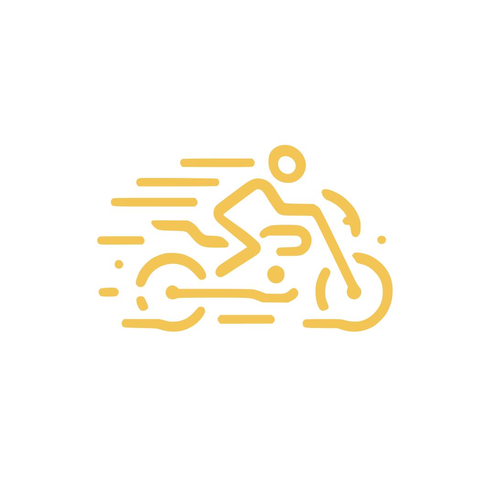

   vCard - Personal Bio        

Tejaswi C
=========

Service Engineer

Show Contacts

*   Email
    
    [tejaswi.c@icloud](mailto:tejaswi.c@icloud.com)
    
*   Phone
    
    [(+91)94XXX13XXX](tel:+919482613888)
    
*   Birthday
    
    April
    
*   Location
    
    Bengaluru, India
    

*   
*   
*   

*   About
*   Resume
*   Contact

About me
--------

Boasting a robust nine-year tenure in the realms of IT and Healthcare IT, I am a seasoned professional specializing in system integration, administration, and technical support. My expertise lies at the intersection of technology and business, where I drive operational efficiencies and innovation.

As a leader, I am passionate about steering teams towards excellence and refining processes to thrive in the dynamic IT environment. My commitment to continuous improvement is unwavering, as I strive to solve complex challenges with simple, elegant, and intuitive solutions.

My role extends beyond mere functionality; I infuse each project with a personal touch, ensuring that your digital presence is not only user-friendly and functional but also aesthetically appealing and intuitive. My goal is to convey your unique message and identity through the most creative and impactful designs. I have had the privilege of crafting web experiences for numerous renowned brands, each time leaving a signature mark of creativity and user-centric design.

### Hobbies

*   
    
    #### Motorcycles
    
    Enthralled by the journey, I find joy in motorcycle rides and the allure of open roads
    
*   
    
    #### Culinary
    
    Exploring the art of flavors, I delight in the culinary journey from kitchen to table.
    
*   
    
    #### Gardening
    
    Cultivating serenity, I cherish the growth and greenery that gardening brings
    
*   
    
    #### Music
    
    Immersed in melodies, I savor the rhythm and harmony of music as it resonates within
    

Resume
------

### Experience

1.  #### Service Engineer - Microsoft Cloud and AI
    
    2023 — Present
    
    I specialize in comprehending the intricacies of service and system design, optimizing technology configurations, and enhancing overall reliability and performance
    
2.  #### Support Engineer - Nuance Communications
    
    2022 - 2023
    
    I adeptly provided exceptional customer service and innovative solutions for issues surrounding Nuance products and their technological frameworks. My role was pivotal in resolving complex problems, ensuring optimal client satisfaction, and actively contributing to continuous process enhancement.
    
3.  #### Technical Support Specialist - S & S Solutions
    
    2010 — 2013
    
    I ensured seamless clinical data flow and delivered technical aid to US healthcare customers. Collaborating with healthcare facilities, ERs, hospitals, and diagnostic centers across all 50 states, I adeptly resolved system issues, optimized workflows, and conducted platform training for Board Certified Radiologists and Technologists. By bridging communication gaps, tracking industry trends, and contributing to IT process enhancement, I ensured efficient data exchange and system reliability
    

### Education

1.  #### Indian Institute of Skill Development
    
    2019 — 2021
    
    Completed Diploma in Computer Science education
    
2.  #### Vivekananda English Medium School
    
    2010 - 2011
    
    Completed Class X (SSLC)
    

### My skills

*   ##### Leadership
    
    80%
    
*   ##### People Management
    
    70%
    
*   ##### Healthcare Information Technology (HIT)
    
    90%
    
*   ##### Software Service Support Engineering
    
    50%
    

Contact
-------

### Contact Form

 

Send Message